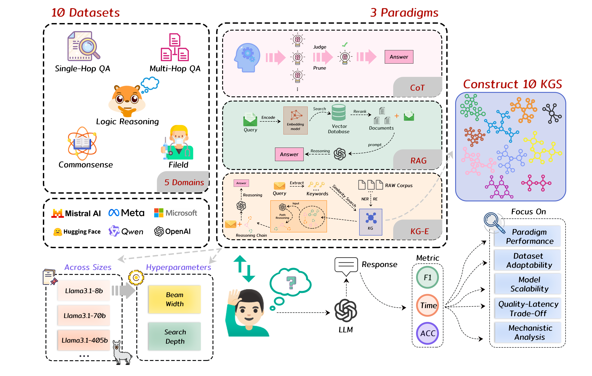

# Are Reasoning Paradigms Scale-Aware? A Cross-Paradigm Verification of Prompting, Retrieval, and Knowledge-Graph Scaffolding for Small Language Models

## 🧭 Abstract

In recent years, reasoning-enhancement paradigms such as chain-based prompting, retrieval-augmented generation, and graph-guided reasoning have significantly improved the performance of large language models on question answering, multi-hop reasoning, and knowledge-intensive tasks. However, whether these methods can be stably transferred to small language models remains insufficiently verified. In real-world deployment, small language models offer advantages such as low cost, low latency, local deployability, and stronger privacy control, but they are also more vulnerable to prompt complexity, retrieval noise, context length, and the organization of external evidence. Therefore, evaluating the effectiveness of different reasoning-enhancement paradigms on smaller models is not only a lightweight deployment issue, but also an important entry point for understanding the boundary conditions of reasoning paradigms.

This repository provides the code implementation and reproducibility package for the question of whether small language models can reliably benefit from different reasoning-enhancement paradigms. The experiments cover three major method families: prompting-based reasoning, text-retrieval-based augmentation, and knowledge-graph-based structured scaffolding. Under a unified experimental protocol, we compare representative paradigms including CoT, CoT-SC, ToT, RAG, LongRAG, GraphRAG, MindMap, and ToG, and analyze their behavioral differences in small-model settings from the perspectives of accuracy, efficiency, robustness, evidence organization, inference latency, and Token cost.

## ✨ Our Contributions

The main contributions stated in the paper are as follows:

1. **Scale-aware transfer analysis.** This study examines whether reasoning-enhancement paradigms originally designed for large language models, including chain-based prompting, retrieval augmentation, and graph-guided scaffolding, remain effective when transferred to 1.7B-8B small language models.
2. **Evidence-interface perspective.** This study frames reasoning enhancement as an interaction between model capacity and evidence organization, and compares prompting, unstructured textual evidence, and structured relational evidence as support interfaces for small language models.
3. **Unified E3 evaluation framework.** This study evaluates representative methods under a shared experimental protocol from three dimensions: effectiveness, efficiency, and robustness. The evaluation covers not only accuracy, but also Token usage, inference latency, performance stability, and small-model compatibility.
4. **Empirical boundary findings.** The experimental results show that reasoning enhancement is not scale-neutral: chain-based prompting can be unstable on ultra-small models, unstructured retrieval often faces cost-effectiveness limitations, while structured relational evidence shows more stable gains in multi-hop and knowledge-intensive tasks.

## 🖼️ Framework



## 🗂️ Quick Navigation

| Section | What It Covers |
| --- | --- |
| [Dataset Preprocessing](#-dataset-preprocessing) | Dataset sources, sampling parameters, and RAG corpus/index construction pointers. |
| [Baselines](#-baselines) | Implemented reasoning paradigms and their corresponding folders. |
| [Evaluation and Statistical Analysis](#-evaluation-and-statistical-analysis-code-guide) | Metric scripts, runtime logs, Token statistics, and evaluation entry points. |
| [Knowledge Graph Size Statistics](#-knowledge-graph-size-statistics) | Entity and relationship counts for each constructed knowledge graph. |

## 📦 Repository Overview

This code repository contains the following materials. The table below also indicates where each part is documented or implemented.

| Material | Documentation and Code Location |
| --- | --- |
| Dataset processing scripts, dataset splits, and sampling lists | See [Dataset Preprocessing](#-dataset-preprocessing), `preprocess/`, and the experimental subsets under `mindmap/dataset/`. |
| Prompt templates and answer-normalization decision rules | Prompt templates are implemented inside each baseline folder. See the corresponding `main.md` files and the dataset execution scripts for each method. |
| Retrieval model and text chunking configuration parameters | See `LongRAG_and_RAG/main.md` for the RAG/LongRAG retrieval workflow, and `corpus_index/main.md` for corpus generation, chunking rules, and index construction. |
| Graph construction scripts and knowledge graph statistics | See `mindmap/main.md` for the knowledge graph construction workflow, and [Knowledge Graph Size Statistics](#-knowledge-graph-size-statistics) for graph-scale summaries. |
| Algorithm-specific configuration files for CoT, CoT-SC, ToT, RAG, LongRAG, GraphRAG, MindMap, and ToG | See each baseline folder, its `main.md` or method documentation, execution scripts, and corresponding source code. |
| Run-log scripts or statistic locations for inference latency and Token consumption | See [Evaluation and Statistical Analysis Code Guide](#-evaluation-and-statistical-analysis-code-guide), which lists the runtime-log and Token-statistic locations for each baseline. |
| Evaluation code and statistical analysis code | See [Evaluation and Statistical Analysis Code Guide](#-evaluation-and-statistical-analysis-code-guide), including metric scripts, evaluation entry points, log parsing, and attention-entropy analysis. |

## 🧪 Dataset Preprocessing

This section describes where the preprocessing code for all datasets is stored, where the RAG corpus preprocessing and corpus-index construction code is located, and how to run the corresponding scripts. The dataset preprocessing scripts are stored under `preprocess/`. The public source links for all datasets are listed below, and the experimental subsets used in this work are stored under `mindmap/dataset/`.

### Dataset Sources

| Dataset | Source |
| --- | --- |
| CommonsenseQA | https://hf-mirror.com/datasets/tau/commonsense_qa |
| CosmosQA | https://hf-mirror.com/datasets/allenai/cosmos_qa |
| Winograd | https://hf-mirror.com/datasets/marcov/winograd_wsc_wsc273_promptsource |
| SciQ | https://hf-mirror.com/datasets/allenai/sciq |
| MedQA | https://github.com/jind11/MedQA |
| HotpotQA | https://huggingface.co/datasets/hotpotqa/hotpot_qa |
| 2WikiMultiHopQA | https://huggingface.co/datasets/framolfese/2WikiMultihopQA |
| SQuAD | https://hf-mirror.com/datasets/rajpurkar/squad |
| LogicBench BQA | https://github.com/Mihir3009/LogicBench |
| LogicBench MCQA | https://github.com/Mihir3009/LogicBench |

### Shared Parameters

All preprocessing scripts support the following parameters:

```bash
python <script>.py \
  --source_path "" \
  --output_dir outputs \
  --split train \
  --seed 931 \
  --sample_size 2000 \
  --eval_size 200
```

`--source_path` is left empty by default. For Hugging Face datasets, the scripts can load the public dataset name directly. If the dataset has already been downloaded locally, `--source_path` can be set to the local dataset directory or file. For MedQA and LogicBench, download the data from GitHub first and then set `--source_path` to the downloaded file or directory.

### Examples

CommonsenseQA:

```bash
python commonsenseqa.py --output_dir outputs
```

SciQ:

```bash
python sciq.py --output_dir outputs
```

MedQA:

```bash
python medqa.py --source_path "" --output_dir outputs
```

LogicBench BQA:

```bash
python logicbench_bqa.py --source_path "" --output_dir outputs
```

LogicBench MCQA:

```bash
python logicbench_mcqa.py --source_path "" --output_dir outputs
```

### RAG Corpus and Index Construction

The corpus generation, text chunking, and vector-index construction workflow used by RAG and LongRAG has been organized under:

```text
corpus_index/
```

`corpus_index/` contains corpus construction scripts for all ten datasets. These scripts generate `data/corpus/raw/<dataset>.json`, `chunks.json`, `id_to_rawid.json`, and `vector.index`. Detailed field extraction rules, default chunking parameters, and execution commands are provided in:

```text
corpus_index/main.md
```

## 🧩 Baselines

Each baseline folder contains its own implementation code, execution scripts, and detailed documentation:

| Folder | Baseline |
| --- | --- |
| `Raw_CoT_CoT-SC/` | Raw prompting, Chain-of-Thought, and Self-Consistency CoT |
| `ToT/` | Tree of Thoughts |
| `LongRAG_and_RAG/` | RAG and LongRAG |
| `graphrag/` | GraphRAG |
| `mindmap/` | MindMap and knowledge graph construction |
| `ToG/` | Think-on-Graph |

The execution scripts and specific configuration information for each baseline are described in detail in the corresponding `main.md` or documentation file. The knowledge graph construction process is described in the MindMap-related documentation. RAG corpus preparation and retrieval index construction are described in `LongRAG_and_RAG/main.md`.

## 📊 Evaluation and Statistical Analysis Code Guide

This section summarizes the evaluation scripts, statistical analysis entry points, and log post-processing logic used across the full repository. It explains where each baseline stores its original evaluation code and how each method outputs metrics.

### Evaluation Code Locations for Each Baseline

#### 1. Raw / CoT / CoT-SC

Folder:

```text
Raw_CoT_CoT-SC/
```

Core metric file:

```text
Raw_CoT_CoT-SC/metric.py
```

Inference and evaluation scripts for each dataset:

```text
Raw_CoT_CoT-SC/2wiki.py
Raw_CoT_CoT-SC/commonsense.py
Raw_CoT_CoT-SC/cosmos.py
Raw_CoT_CoT-SC/hotpotqa.py
Raw_CoT_CoT-SC/logicbench.py
Raw_CoT_CoT-SC/medqa.py
Raw_CoT_CoT-SC/sciq.py
Raw_CoT_CoT-SC/squad.py
Raw_CoT_CoT-SC/winograd.py
```

Evaluation method:

- Multiple-choice and binary classification datasets usually compute `Accuracy`.
- Open-domain QA datasets such as HotpotQA, 2WikiMultiHopQA, and SQuAD compute QA metrics such as EM/F1 through `metric.py`.
- The scripts use `time.time()` to print runtime.
- The scripts record `total_prompt_tokens`, `total_completion_tokens`, and `total tokens`.

Original attention entropy script:

```text
Raw_CoT_CoT-SC/entropy.py
```

#### 2. Tree of Thoughts (ToT)

Folder:

```text
ToT/
```

Main evaluation entry point:

```text
ToT/run.py
```

Token statistics location:

```text
ToT/src/tot/models.py
```

Task-level evaluation code:

```text
ToT/src/tot/tasks/
ToT/src/tot/tasks/metric.py
```

Evaluation method:

- `run.py` writes the runtime records of each task to:

```text
ToT/logs/<task>/
```

- `run.py` computes task metrics through the `test_output()` method in each task class.
- Open-domain QA tasks use F1-style evaluation.
- Other tasks usually use exact match or task-specific correctness labels.
- `run.py` prints the total runtime.
- `models.py` records prompt tokens, completion tokens, and total tokens through `gpt_usage()`.

#### 3. RAG and LongRAG

Folder:

```text
LongRAG_and_RAG/
```

Main evaluation entry point:

```text
LongRAG_and_RAG/src/main.py
```

Metric file:

```text
LongRAG_and_RAG/src/metric.py
```

Index construction runtime statistics:

```text
LongRAG_and_RAG/src/gen_index.py
```

Evaluation method:

- `src/main.py` runs RAG/LongRAG modes such as `--rb` and `--ext_fil`.
- F1 is computed through `F1_scorer()`.
- Accuracy-style summary fields such as `LONGACC` and `RBACC` are printed.
- Runtime for each sample or method is accumulated into the `"time"` field of the output dictionary.
- Prompt tokens and completion tokens are recorded through `gpt_usage()`.
- Cached prediction results are written to:

```text
LongRAG_and_RAG/src/log/<index_setting>/<dataset>/<model>/<lrag_model_or_base>/<timestamp>/
```

#### 4. GraphRAG

Folder:

```text
graphrag/
```

Evaluation scripts for each dataset:

```text
graphrag/code/bqa.py
graphrag/code/commonsenseqa.py
graphrag/code/cosmosqa.py
graphrag/code/hotpotqa.py
graphrag/code/mcqa.py
graphrag/code/medqa.py
graphrag/code/sciq.py
graphrag/code/squad.py
graphrag/code/wiki.py
graphrag/code/winograd.py
```

Metric file:

```text
graphrag/code/metric.py
```

Evaluation method:

- Each dataset script calls `graphrag query` through `subprocess.run()`.
- Multiple-choice and binary classification datasets print `ACC`.
- Open-domain QA datasets use `F1_scorer()` in `graphrag/code/metric.py`.
- Total runtime is measured and printed through `time.time()`.
- The current scripts mainly print results to stdout. If persistent logs are required, it is recommended to use shell redirection during execution or a unified runner to save stdout/stderr.

#### 5. MindMap

Folder:

```text
mindmap/
```

Main evaluation entry point:

```text
mindmap/mindmap.py
```

Metric file:

```text
mindmap/metric.py
```

Evaluation method:

- `mindmap.py` builds or connects to the Neo4j graph, retrieves graph evidence, generates final answers, and performs evaluation.
- The script prints the prediction and answer for each sample.
- F1 is computed through `F1_scorer()`.
- The script finally prints `F1`, `ACC`, and total runtime.

#### 6. Think-on-Graph (ToG)

Folder:

```text
ToG/
```

Main evaluation entry point:

```text
ToG/ToG/main_wiki.py
```

Utility functions and Token statistics:

```text
ToG/ToG/utils.py
```

Metric file:

```text
ToG/ToG/metric.py
```

Original additional evaluation script:

```text
ToG/eval/eval.py
```

Evaluation method:

- `main_wiki.py` performs graph-guided reasoning and writes JSONL results to:

```text
ToG/ToG/misral/ToG_<dataset>.jsonl
```

- After inference, the script reads the generated results, aligns them with the ground truth, and prints F1 and Accuracy.
- The script prints total runtime.
- `utils.py` records prompt tokens, completion tokens, and total tokens through `gpt_usage()`.
- `ToG/eval/eval.py` is an exact-match-style evaluation script retained from the original ToG workflow.

### Output Logs

When running evaluation code, it is recommended to save stdout/stderr for unified parsing. The output contains runtime progress, ACC/F1 metrics, Token consumption, and runtime.

## 🛠️ Reproducibility Notes

For reproduction, please carefully read the `main.md` of each method and follow the corresponding steps and explanations.

This repository does not include large model weights or private runtime resources. Please download the required embedding, reranking, and generation models yourself according to the instructions in each baseline folder.

## 🕸️ Knowledge Graph Size Statistics

The following table shows the size of the knowledge graphs constructed for each dataset. The bar charts are normalized by the maximum value in this table, making it easier to quickly compare the number of entity nodes and relationships across datasets.

| Dataset | #Entity Nodes | Node Scale | #Relationships | Relationship Scale |
| --- | ---: | --- | ---: | --- |
| 2WikiMultiHopQA | 575 | ██████░░░░ | 1492 | ██████░░░░ |
| LogicBench-BQA | 166 | ██░░░░░░░░ | 538 | ██░░░░░░░░ |
| CommonsenseQA | 355 | ████░░░░░░ | 711 | ███░░░░░░░ |
| CosmosQA | 325 | ███░░░░░░░ | 1012 | ████░░░░░░ |
| HotpotQA | 977 | ██████████ | 2359 | █████████░ |
| LogicBench-MCQA | 78 | █░░░░░░░░░ | 140 | █░░░░░░░░░ |
| MedQA | 711 | ███████░░░ | 2504 | ██████████ |
| SciQ | 36 | █░░░░░░░░░ | 70 | █░░░░░░░░░ |
| SQuAD | 129 | █░░░░░░░░░ | 264 | █░░░░░░░░░ |
| Winograd | 91 | █░░░░░░░░░ | 285 | █░░░░░░░░░ |

## 📚 Citation

If you use this codebase, please cite the corresponding paper once the final citation information is available.
